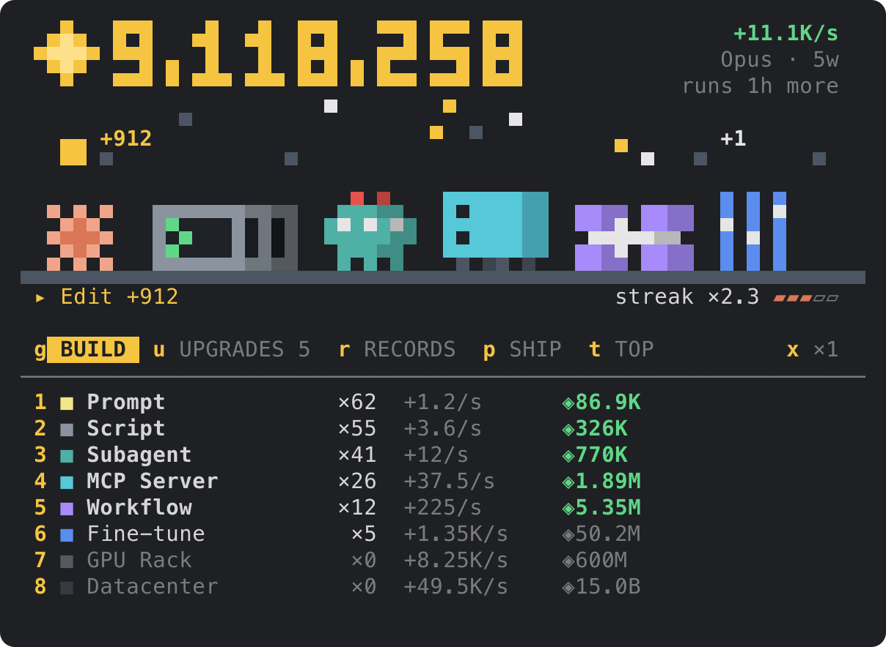

# claude-tycoon

Token Tycoon: an idle game that runs inside [Claude Code](https://claude.com/claude-code), where Claude's tool calls earn the money.

Type `/tycoon`, buy your first Prompt, and let Claude work. What you build is kept between sessions.



## Install

```sh
claude plugin marketplace add barisdemirhan/claude-tycoon
claude plugin install tycoon@claude-tycoon
```

Restart Claude Code, then run `/tycoon`.

## How it earns

- **Every tool call Claude makes pays tokens.** What it pays depends on the kind of work: reading, editing, shell, web, delegation to subagents, MCP tools. A call that failed pays half; one that was refused pays nothing.
- **Calls close together build a streak.** Each call within 20 seconds of the last raises the pay, up to a cap that upgrades lift. A minute of silence ends the streak.
- **The end of a turn pays a salary**, sized by the output tokens the turn really cost.
- **Generators make tokens every second**, from the Prompt up to the Matrioshka Brain. Each one bought costs 15% more than the last.
- **Generators run on unattended for as long as the context window lasts**: one hour after the last activity, up to a day with upgrades. Any tool call, in any session, starts the clock again, and a session that opens after time away says what was made.
- **You can mine by hand** with `space`, or a click on the scene, for a little.

The pane is the game's own screen: the balance in large digits, a scene where every kind of generator you own stands under the sky and a coin rises for each tool call, and under it the shop. Wide panes set the scene beside the shop; narrow ones, over it.

The scene grows with what you own. A kind stands again behind itself at 10, 50 and 100 owned, a buy lights its generator up with the count over it, an upgrade shows what it changed, and every model shipped is a gold star in the sky.

## What you keep

- **Upgrades** double a generator, raise what a kind of call pays, make every call also pay seconds of what the generators make, lift the streak's cap, and lengthen the context window. They open as you own more and as Claude calls more tools.
- **Achievements** each add 2% to everything, for good.
- **Shipping a model** gives up the run's tokens, generators and upgrades for weights. Each weight adds 5% to everything, for good, and the rank goes from Haiku up to Mythos.

The game is built to last: the last generators are out of reach until a few models have shipped.

## The global top

The global top is a leaderboard everybody who joins shares, ranked by the tokens earned in all. It is off until you join: the Top tab asks for a name in the keys field, and enter joins with it. Enter alone puts the question away, and `/tycoon name off` stops it for good. `/tycoon name <name>` joins at any time.

The board is read a page at a time: ten rows a page, ten pages, the first hundred. On the Top tab the keys `1` to `9` and `0` turn to a page, and `/tycoon top 3` prints one. Your own row is marked, and the line under the page says where you stand even when that is past the hundredth.

A name takes 2 to 16 letters, digits, `-` or `_`, and belongs to whoever took it first. What proves it is yours is a secret kept in the plugin's store on this machine: on another machine, or after the store is cleared, the name is taken and you need a new one.

Once you are on it, your save goes up by itself: when you join, when you look at the board, after a ship, and at the end of a turn, ten minutes apart at the least. A toast says so when it moved you up.

**Saves are not taken as told.** The game never sends a score. It sends the save, and the server reads it with the game's own rules (`hooks/sim.ts` and `hooks/catalog.ts`, the same files): what a run holds must have been paid for out of what the run earned, every upgrade and achievement must be open by the save's own counts, and weights must come of lifetime earnings. A save that does not add up is refused.

What that cannot tell is whether Claude really made the calls. Months of an idle game cannot be played again the way one run of a runner can, so a made-up save that adds up passes that reading. Against that the server holds back a save that claims more than the fastest play could have earned since the board opened until it has been looked over, and keeps every player's latest save so that one can be read and removed. Read the board as a bit of fun, not as a referee.

A save only counts under the rules it was played by. When an update changes a price or a rule, an older plugin is told to update before its saves go up again.

## Play

| Key | Action |
| --- | --- |
| `space`, `m`, `enter` | Mine by hand |
| `1`-`9`, `0`, `q`, `w` | Buy the generator or the upgrade on that row |
| `x` | Buy 1, 10 or 100 generators at a time |
| `b` | On the upgrades tab, buy every upgrade the balance covers |
| `g` `u` `r` `p` `t` | The Build, Upgrades, Records, Ship and Top tabs |
| `y` | On the ship tab, ship: twice, since it gives the run up |
| `1`-`9`, `0` | On the top tab, the page of that number: `0` is the tenth |
| `n` | On the top tab, take a name for the global top |
| `esc` | Give the keys back to the prompt |
| `ctrl+x` `tab` | Give the keys back to the game |

A click does what a key does: on a row it buys, on a tab it shows it, on the scene it mines.

The balance also shows on the hint line under the prompt, with what waits on you: the upgrades the balance covers (`↑2`), a ship that is due, and your place on the global top (`#12`). In the fullscreen layout it stands at the line's right end, and a click on it opens the pane and closes it.

| Command | What it does |
| --- | --- |
| `/tycoon` or `/tycoon play` | Opens the game |
| `/tycoon stop` | Closes the pane. The game goes on earning |
| `/tycoon stats` | The balance and the counts, as one line |
| `/tycoon top` | The first page of the global top. `/tycoon top 3` is the third |
| `/tycoon name <name>` | Joins the global top under that name, or changes the name you have there. `/tycoon name` says who you are on it, `/tycoon name off` stops the Top tab asking |
| `/tycoon leave` | Takes you off the global top and deletes your save there |
| `/tycoon hint` | Takes the balance off the hint line under the prompt, or puts it back. `/tycoon hint on` and `/tycoon hint off` say which |
| `/tycoon reset confirm` | Deletes the save |

## Requirements

- A Claude Code build with mod support (plugins that ship a hooks module). Built and tested on 2.1.287. Mods sit behind a rollout switch, so if `/tycoon` does not show up after installing, the switch may still be off for you.
- The terminal or the desktop app for the game's own screen. Other surfaces get the same game as buttons and text.
- A pane at least 36 columns wide and 10 rows tall.

## What it does on your machine

The mod registers one slash command and draws one pane. It reads no files and runs no processes. It never changes a prompt, a tool call or a tool's result.

It makes no network request unless you use the global top. Then it talks to one server, `claude-tycoon-board.barisdemirhan.workers.dev`, through Claude Code's own `$.http.fetch`:

- `/tycoon top`, and the Top tab in the game, ask for a page of the board. If you have joined, they send your id along to learn where you stand.
- Joining sends the name you chose, a random id and a random secret made on your machine. The secret is what makes a save yours.
- Your save goes up as described above: the balance, what the run and the save have earned, how many of each generator you own, the upgrades and achievements you hold, your weights and ships, and the counts of calls by kind of work, failed calls, turns, clicks and generators bought. The real tokens Claude's turns cost are not in it, nor a tool's name, nor anything else of your session.

The server keeps your name, your id, a hash of the secret, what your best save earned and your latest save. To slow a flood it also keeps a salted hash of the address a write came from, which later writes clear out once it is an hour old. `/tycoon leave` deletes your name and your save.

The same as a privacy policy: [PRIVACY.md](PRIVACY.md).

It reads two things of each tool call Claude makes: the tool's name, to pay it by its kind and show it in the pane, and whether the call failed. It reads nothing of the call's arguments or output. Of each turn's end it reads one number: the output tokens the turn cost.

It saves three things in the plugin's own Claude Code store: the game (the balance, what you own, the counts above), your one setting and, once you join the global top, your name, id and secret there. Several sessions share that save. Each change reads it before writing it, so two sessions earn side by side; if both write in the same instant, the later one stands.

Its hooks, all in `hooks/register.tsx`:

- `session.start` registers the `/tycoon` command, loads the setting and who you are on the global top, and settles the save, then passes the event on unchanged.
- `command.run` answers only the `/tycoon` command. Other commands never reach it.
- `ui.render` draws only the mod's own pane. It also adds the balance to the hint line under the prompt: a button laid over the line's right end where a click can reach it, a tail after the line's text elsewhere. The line itself is left as the engine and other mods drew it.
- `ui.message` acts only on the keys the mod's own screen posts. Any other message is passed on untouched.
- `ui.close` notes that the mod's own pane closed, and passes every close on.
- `tool.call` pays each call after it ran, as described above, and passes each call and its result on untouched.
- `turn.complete` pays the turn's salary and, if you are on the global top, sends the save as described above. It passes the event on unchanged.

The files under `tests/` run only under `claude plugin test`. They mount the pane in the test harness and are never loaded in a session.

## Develop

```sh
git clone https://github.com/barisdemirhan/claude-tycoon
claude plugin validate claude-tycoon/.claude-plugin/plugin.json
claude plugin test claude-tycoon
claude --plugin-dir claude-tycoon
```

`hooks/catalog.ts` is everything the game sells and awards, as data: a new generator, upgrade tier or achievement is a new row there. `hooks/sim.ts` holds the rules, `hooks/bank.ts` reads the save back from the store and `hooks/register.tsx` holds the hooks.

`hooks/board.ts` is the global top as the plugin sees it, and `worker/` is its server: a Cloudflare Worker over a D1 database that imports the rules from `hooks/`. `wrangler dev` in `worker/` runs it on your machine. A change to a price or a rule raises `RULES` in `hooks/sim.ts`, and the server is deployed with it.

The screen is `hooks/game.tsx`, painted on the pixel canvas of `hooks/canvas.ts` with the sprites of `hooks/art.ts`. `hooks/screen.ts` says what each tab lists and what a key means there, for the screen and for `hooks/pane.tsx`, the buttons the other surfaces get.

## License

MIT
